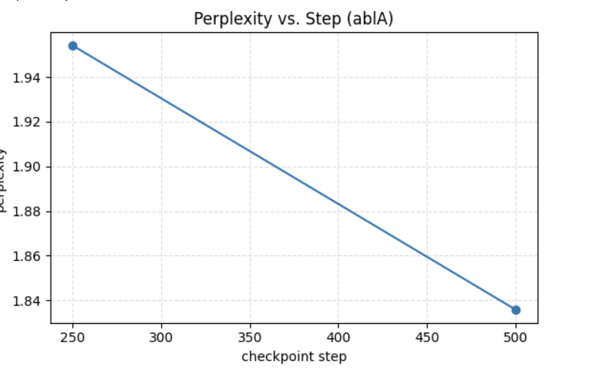
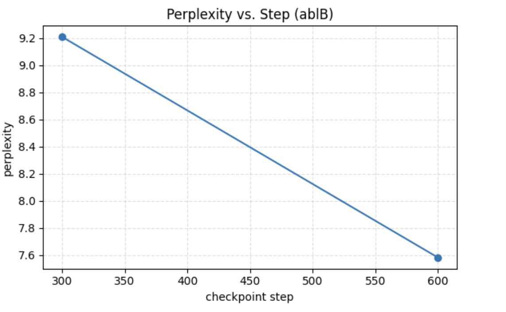
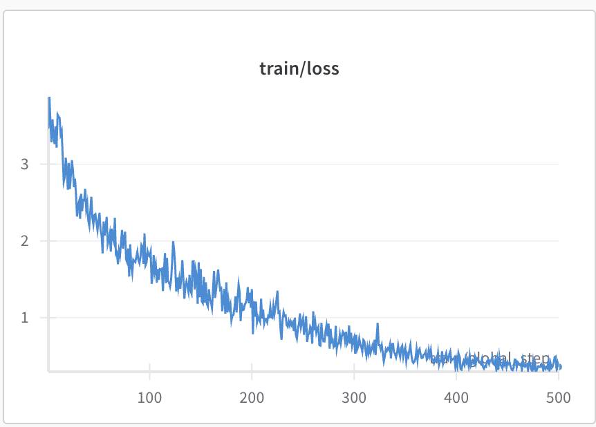
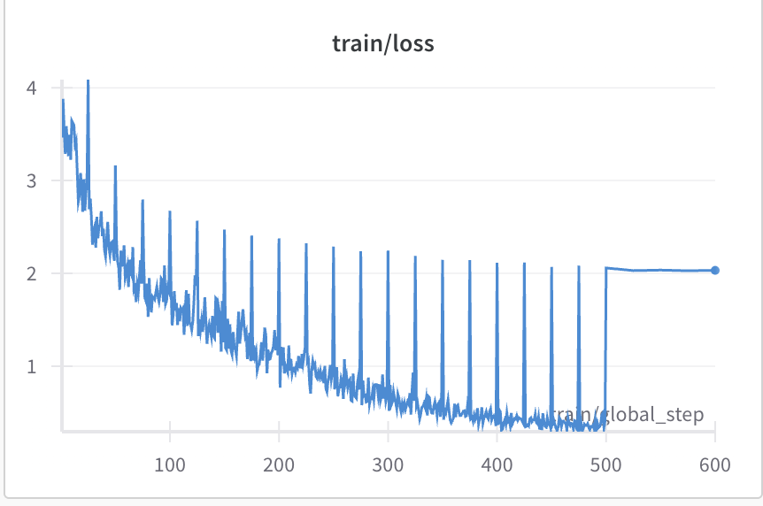

# LoRA Fine-Tuning for Greentext Generation

This project fine-tunes a small language model with LoRA (Low-Rank Adaptation) on a tiny slice of a greentext dataset, evaluates results with perplexity and sample generations, and compares ablations (LoRA rank and base model).

## TL;DR

- Model: `HuggingFaceTB/SmolLM-135M` fine-tuned with LoRA (via TRL/PEFT)
- Data: `maxmyn/wholesome_greentext_110k` (small slice)
- Results (perplexity): Baseline ≈ 1.455 → Ablation A (rank 8) ≈ 1.238; GPT-2 (same settings) ≈ 6.447
- Training time: ~18 minutes for 500 steps on a T4-class GPU

## Figures

Only the key plots used in the report:

- Perplexity vs. Step (Ablation A)

  

- Perplexity vs. Step (Ablation B)

  

- Train loss (SmolLM / Ablation A)

  

- Train loss (GPT‑2 / Ablation B)

  

## Sample Generation

Prompt

> Imagine being able to fly
> Picture yourself soaring through the sky
> Realize you’re afraid of heights
>

Continuations (single-line, temperature 0.7, top-p 0.9)

- Base (untuned): Panic when wings aren’t included
- Baseline LoRA (r=4): Go back to video games because gravity is OP
- Ablation A (SmolLM r=8): Accept your fear and step
- Ablation B (GPT‑2 r=4): Realize you’re

## Results

| Run                       | Model                    | LoRA r | PPL (↓) |
|---------------------------|--------------------------|--------|---------|
| Baseline                  | SmolLM‑135M              | 4      | 1.455   |
| Ablation A (rank increase)| SmolLM‑135M              | 8      | 1.238   |
| Ablation B (base swap)    | GPT‑2 Small              | 4      | 6.447   |

Takeaways

- Increasing LoRA rank (r=4 → r=8) reduced perplexity on this micro‑dataset slice.
- A straight GPT‑2 swap under identical settings underperformed; likely needs more data/steps or different hyperparameters.

## How To Run

Environment (Python 3.10+ recommended):

```
pip install transformers peft trl datasets wandb tabulate
```

Run the notebook:

1) Open `LoRA_SFT.ipynb`
2) (Optional) Log into Weights & Biases to track metrics: `wandb.login()`
3) Run all cells

Notes

- Default training is ~500 steps, batch size 4, learning rate 2e‑4.
- On a T4-class GPU, runtime is roughly 15–20 minutes.

## Method

- Base model and tokenizer: `HuggingFaceTB/SmolLM-135M`
- Dataset: `maxmyn/wholesome_greentext_110k` (small slice for speed)
- LoRA target modules: `q_proj`, `k_proj`, `v_proj`, `o_proj`, `up_proj`, `down_proj`, `gate_proj`
- Trainer: TRL `SFTTrainer` with `SFTConfig`

## Ablations

- Rank: r=4 (baseline) vs r=8 (Ablation A)
- Base model: SmolLM‑135M vs GPT‑2 Small (Ablation B)

## Future Work

- Add a held‑out validation split (current PPL reflects the train slice)
- LR sweep for GPT‑2 and/or increase steps/slice size
- Consider QLoRA and a larger model for stronger results

